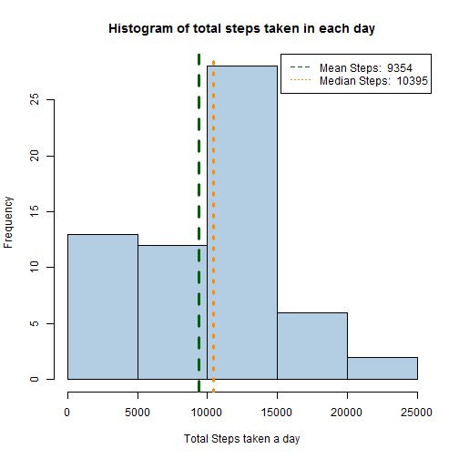

Personal Activity Monitoring Device Analysis
===================================================================

Objective
---------

It is now possible to collect a large amount of data about personal movement using activity monitoring devices such as a Fitbit, Nike Fuelband, or Jawbone Up. These type of devices are part of the "quantified self" movement - a group of enthusiasts who take measurements about themselves regularly to improve their health, to find patterns in their behavior, or because they are tech geeks. But these data remain under-utilized both because the raw data are hard to obtain and there is a lack of statistical methods and software for processing and interpreting the data.

The purpose of this analysis is to make use of data from a personal activity monitoring device. This device collects data at 5 minute intervals through out the day.

<style type="text/css">

        /*  CSS chunck 1  */
        th {  background-color:#E0E0E0 ;
                border-bottom:1px solid black;
                padding:5px;}

        td{
        border-bottom:1px dotted black;
        padding:10px;}

        table{ 
                border-collapse:collapse;
                margin:left;
                border: 1px solid black;} 
 
</style>


A sample of the file being processed is illustrated below:

```
##   steps       date interval
## 1    NA 2012-10-01        0
## 2    NA 2012-10-01        5
## 3    NA 2012-10-01       10
## 4    NA 2012-10-01       15
## 5    NA 2012-10-01       20
## 6    NA 2012-10-01       25
```

Total number of steps taken per day
---------------------------------------

A histrogram of the number of steps taken each day is shown below

 

A basic five number summary of the total steps taken in each day:

```
##    Min. 1st Qu.  Median    Mean 3rd Qu.    Max. 
##       0    6780   10400    9350   12800   21200
```
<!--- comment: insert line breaks -->
<br />
<br />


Averge daily activity pattern
-------------------------------------------
In an attempt to find out what is the average daily activity pattern of a person, a time series plot of the average steps made in each 5 minute interval is made. 

 


Clearly, interval **835** has the greatest average number of steps **(206.1698)**.

<br />
<br />


New dataset with "NA"" accounted
-------------------------------------------
In the previous calculation, we had ignored the effects of NA in the calculations. Here, we assume the NA values take on the average mean value of that particular interval. Example, if interval 53 at 2012-10-31 has a NA value, we would use the average steps made in the 53th interval (seen in the "Averge daily activity pattern" plot).

A sample of the new dataset is illustrated below:


### Old dataset:

```
##   steps       date interval
## 1    NA 2012-10-01        0
## 2    NA 2012-10-01        5
## 3    NA 2012-10-01       10
## 4    NA 2012-10-01       15
## 5    NA 2012-10-01       20
## 6    NA 2012-10-01       25
```


### New dataset:

```
##          steps       date interval
## 152651 1.71698 2012-10-01        0
## 152741 0.33962 2012-10-01        5
## 152811 0.13208 2012-10-01       10
## 152931 0.15094 2012-10-01       15
## 152971 0.07547 2012-10-01       20
## 153091 2.09434 2012-10-01       25
```


Total number of steps taken per day (New Dataset)
------------------------------------------------

A histrogram of the number of steps taken each day is shown below:

 

Comparing the means of both the old and new datasets, we saw that 

     | Mean                                      | Median
-----|-------------------------------------------|-----------------
 Old | 9354   | 1.0395 &times; 10<sup>4</sup>
 New | 1.0766 &times; 10<sup>4</sup>  | 1.0766 &times; 10<sup>4</sup>

A deeper look into the reason for this change, revealed that there are days in the old dataset having all NA readings. It could mean that the user might have switched off the device for that day. Hence, by auto-filling the days with the mean values for the 5 minute intervals will significantly change the mean and media values.

<br />
<br />

Day of the week activity
---------------------------------

Let us now look at the difference in activity between weekdays and weekends.

 

Clearly from the plots, the activities in both the weekdays and weekends are very similar. 
